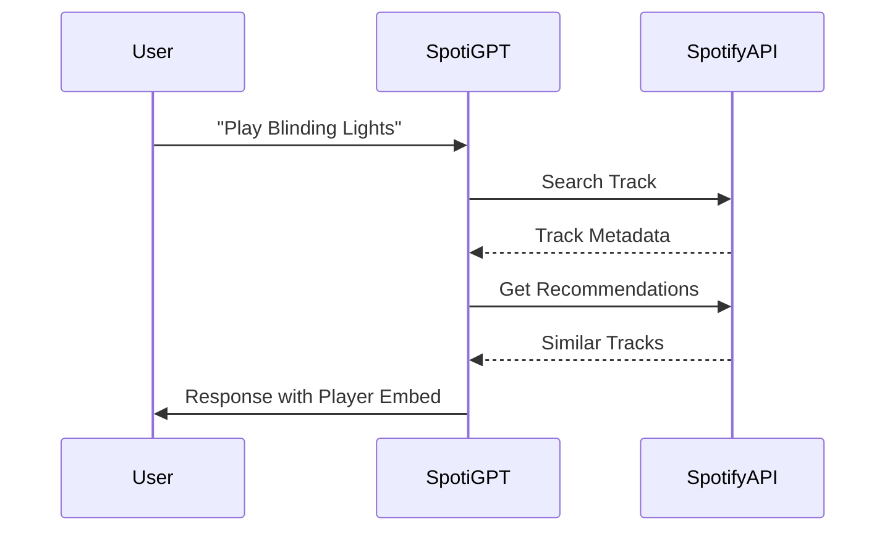

# SpotiGPT - Music Knowledge Assistant 🎵

 *Example of SpotiGPT in action*

## Table of Contents
- [Overview](#overview)
- [Core Architecture](#core-architecture-retrieval-augmented-generation-rag)
- [Performance Optimization](#performance-optimization)
- [API flow](#spotify-api-flow)
- [Features](#features)
- [Technologies](#technologies)
- [Installation](#installation)
- [Usage](#usage)
- [API Endpoints](#api-endpoints)
- [Project Structure](#project-structure)
- [Version History](#version-history)
- [Contributing](#contributing)
- [License](#license)

## Overview

SpotiGPT is an intelligent music assistant powered by RAG (Retrieval-Augmented Generation) technology. It combines Cohere's language models with music data from Spotify, Genius Lyrics, and MusicBrainz to provide accurate information about artists, songs, albums, and music theory.

### Core Architecture: Retrieval-Augmented Generation (RAG)

SpotiGPT implements a sophisticated RAG pipeline that combines:

1. **Retrieval Component**:
   - ChromaDB vector database with Cohere embeddings
   - Hybrid search (dense + keyword)
   - Contextual chunking of music knowledge

2. **Generation Component**:
   - Cohere's Command model for response generation
   - Context enrichment from multiple APIs
   - Response post-processing


### Performance Optimization

| Parameter | Value | Description |
|-----------|-------|-------------|
| chunk_size | 512 | Token limit per chunk |
| overlap | 128 | Chunk overlap tokens |
| embedding_model | embed-english-v3.0 | Cohere's best model for search |
| n_results | 5 | Documents retrieved per query |
| rerank_method | reciprocal_rank_fusion | Hybrid scoring algorithm |

## API Integration Details

### Spotify API Flow




## Features

**Artist Information**  
**Album Details**  
**Song Recognition**  
**Lyrics Retrieval**  
**Music Theory Explanations**  
**Spotify Integration**  
**Natural Language Understanding**  
**Web Interface**  

## Technologies

### Core Stack
- **Backend**: Python 3.9+
- **Web Framework**: Flask 2.0
- **Vector Database**: ChromaDB
- **LLM**: Cohere API

### Music APIs
- **Spotify Web API**
- **Genius Lyrics API**
- **MusicBrainz API**

### Frontend
- HTML5, CSS3 (Flexbox/Grid)
- Vanilla JavaScript (ES6+)
- Responsive Design

## Installation

### Prerequisites
- Python 3.9+
- Spotify Developer Account
- Genius API Token
- Cohere API Key

### Setup Instructions

1. Clone the repository:
```bash
git clone https://github.com/yourusername/spotigpt.git
cd spotigpt
```

2. Create and activate virtual environment:
```bash
python -m venv venv
source venv/bin/activate  # Linux/Mac
venv\Scripts\activate     # Windows
```

3. Install dependencies:
```bash
pip install -r requirements.txt
```

4. Create `.env` file:
```env
COHERE_API_KEY=your_cohere_key
SPOTIFY_CLIENT_ID=your_spotify_id
SPOTIFY_CLIENT_SECRET=your_spotify_secret
GENIUS_API_TOKEN=your_genius_token
```

## Usage

### Running the Application

Start the development server:
```bash
python webui.py
```

The application will be available at `http://localhost:5000`

### Command Line Interface

For CLI usage (original version):
```bash
python app.py
```

## API Endpoints

| Endpoint | Method | Description |
|----------|--------|-------------|
| `/` | GET | Web interface |
| `/chat` | POST | Chat endpoint (accepts JSON: `{"message": "your query"}`) |

## Project Structure

```
spotigpt/
├── app/                  # Core chatbot logic
│   ├── __init__.py
│   ├── chatbot.py        # Main chatbot class
│   ├── services/         # API integrations
│   │   ├── spotify.py
│   │   ├── genius.py
│   │   └── musicbrainz.py
│   └── utils/           # Utilities
│       ├── database.py
│       └── embeddings.py
├── webui/               # Web interface
│   ├── static/
│   │   ├── style.css
│   │   └── script.js
│   └── templates/
│       └── index.html
├── data/                # Knowledge base
│   ├── music_theory.txt
│   └── spotify_faqs.txt
├── tests/               # Unit tests
├── requirements.txt     # Dependencies
├── app.py               # CLI version
└── webui.py            # Web application entry
```

## Version History

### v1.0.0 (Current)
- Initial release with full RAG implementation
- Web interface with Cohere-inspired design
- Integration with Spotify, Genius, and MusicBrainz APIs

### v0.2.0 (Beta)
- Added ChromaDB vector storage
- Improved knowledge base
- Basic web interface

### v0.1.0 (Alpha)
- Command-line only version
- Basic Cohere integration
- Minimal music knowledge base

## Contributing

We welcome contributions! Please follow these steps:

1. Fork the repository
2. Create your feature branch (`git checkout -b feature/AmazingFeature`)
3. Commit your changes (`git commit -m 'Add some amazing feature'`)
4. Push to the branch (`git push origin feature/AmazingFeature`)
5. Open a Pull Request

## License

Distributed under the MIT License. See `LICENSE` for more information.

---

**Developed  by [Aswathi Ranjith]**  
[](https://github.com/yourusername) 
[](https://linkedin.com/in/yourprofile)
